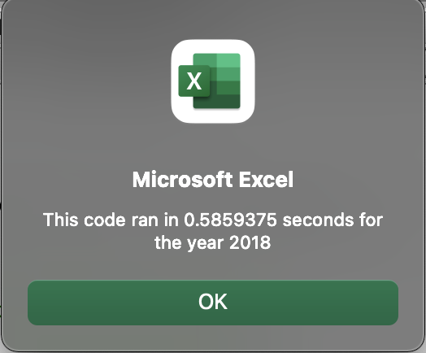
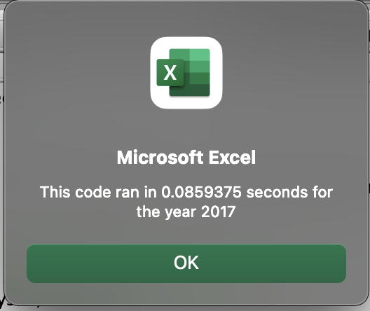
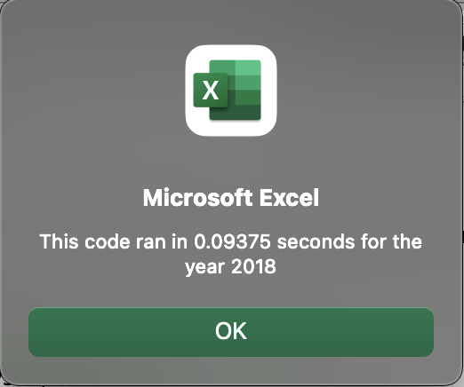

# Stocks Analysis

## Overview of Project

This project was created to analyze the outcomes of refactoring code, in order to speed up the run time of the analysis in VBA. Steve, the person who is asking us to create this code, originally asked us to analyze stock results of 12 stocks. However, he wants to expand the selection, and analyze a much greater volume of stocks in the future. Therefore, we must refactor this code in order to make it faster, and work for a larger set of data. 
In this analysis, we are looking at the run time of the original, not-refactored code, and comparing it to the run time of the refactored code. 

## Results

### Run time for the original VBA code
If we run the original code, we get the following run times for 2017 and 2018, for the 12 stocks that are part of the analysis in this project:

	
### Run time for the refactored code
The run time of the refactored code, is outlined below:

Evidently, the refactored code is running faster than the original code, which is a great sign, since it will mean that a larger set of data will run with much more efficiency than the original code used in the analysis.

## Summary

- What are the advantages or disadvantages of refactoring code?

- How do these pros and cons apply to refactoring the original VBA script?
